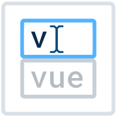

<div>
<p align="center"></a></p>

<h1>vue-autosuggest</h1>

<p>🔍 Autosuggest component built for Vue.</a></p>
</div>

<hr />

[![Build Status][build-badge]][build]
[![Code Coverage][coverage-badge]][coverage]
[![version][version-badge]][package]
[![downloads][downloads-badge]][npmtrends]
[![MIT License][license-badge]][LICENSE]
[![gzip size][size-badge]](https://unpkg.com/vue-autosuggest@latest)

[](#contributors)
[![PRs Welcome][prs-badge]][prs]
[![Code of Conduct][coc-badge]][coc]

[![Watch on GitHub][github-watch-badge]][github-watch]
[![Star on GitHub][github-star-badge]][github-star]
[![Tweet][twitter-badge]][twitter]

## Table of Contents

* [Examples](#examples)
* [Features](#features)
* [Installation](#installation)
* [Usage](#usage)
* [Props](#props)
* [Inspiration](#inspiration)
* [Contributors](#contributors)
* [LICENSE](#license)

## Examples

* <a href="https://darrenjennings.github.io/vue-autosuggest">Demo</a>
* <a href="https://darrenjennings.github.io/vue-autosuggest/storybook">Storybook</a> Helpful to see all
  variations of component's props.<br/>
* <a href="https://jsfiddle.net/darrenjennings/dugbvezs/">JSFiddle</a> Helpful for playing around
  and sharing.
* Codesandbox Demos:

  * [Deeply nested data objects as suggestions](https://codesandbox.io/s/vueautosuggest-api-data-objects-0nudq)
  * [Api Fetching suggestions with Multiple sections](https://codesandbox.io/s/vueautosuggest-api-fetching-57d4e)
  * [Form Validation with VeeValidate](https://codesandbox.io/s/vueautosuggest-vee-validate-ve13m)
  * [Multiple VueAutosuggest instances on same page](https://codesandbox.io/s/vueautosuggest-multiple-vue-autosuggests-545ee)
* [Integration with Algolia](https://www.algolia.com/doc/guides/building-search-ui/resources/ui-and-ux-patterns/in-depth/autocomplete/vue/?language=vue#results-page-with-autocomplete) thanks to [@haroenv](https://github.com/haroenv)!

## Features

* WAI-ARIA complete autosuggest component built with the power of Vue.
* Full control over rendering with built in defaults or custom components for rendering.
* Easily integrate AJAX data fetching for list presentation.
* Supports multiple sections.
* No opinions on CSS, full control over styling.
* Rigorously tested.

## Installation

This module is distributed via [npm][npm] which is bundled with [node][node] and
should be installed as one of your project's `dependencies`:

```
npm install vue-autosuggest
```

or

```
yarn add vue-autosuggest
```

## Usage

Load VueAutosuggest into your vue app globally.

```js
import VueAutosuggest from "vue-autosuggest";
Vue.use(VueAutosuggest);
```

or locally inside a component:

```js
import { VueAutosuggest } from 'vue-autosuggest';
export default {
  ...
  components: {
      VueAutosuggest
  }
  ...
};
```

Place the component into your app!

```html
<vue-autosuggest
    :suggestions="[{data:['Frodo', 'Samwise', 'Gandalf', 'Galadriel', 'Faramir', 'Éowyn']}]"
    :input-props="{id:'autosuggest__input', placeholder:'Do you feel lucky, punk?'}"
    @input="onInputChange"
    @selected="selectHandler"
    @click="clickHandler"
>  
  <template slot-scope="{suggestion}">
    <span class="my-suggestion-item">{{suggestion.item}}</span>
  </template>
</vue-autosuggest>

```

Advanced usage:

<details><summary>Click to expand</summary><p>

```html
<template>
  <div class="demo">
    <div v-if="selected" style="padding-top:10px; width: 100%;">
      You have selected <code>{{selected.name}}, the {{selected.race}}</code>
    </div>
    <div class="autosuggest-container">
      <vue-autosuggest
        v-model="query"
        :suggestions="filteredOptions"
        @focus="focusMe"
        @click="clickHandler"
        @input="onInputChange"
        @selected="onSelected"
        :get-suggestion-value="getSuggestionValue"
        :input-props="{id:'autosuggest__input', placeholder:'Do you feel lucky, punk?'}">
        <div slot-scope="{suggestion}" style="display: flex; align-items: center;">
          
          <div style="{ display: 'flex', color: 'navyblue'}">{{suggestion.item.name}}</div>
        </div>
      </vue-autosuggest>
    </div>
  </div>
</template>

<script>
import { VueAutosuggest } from "vue-autosuggest";

export default {
  components: {
    VueAutosuggest
  },
  data() {
    return {
      query: "",
      selected: "",
      suggestions: [
        {
          data: [
            { id: 1, name: "Frodo", race: "Hobbit", avatar: "https://upload.wikimedia.org/wikipedia/en/thumb/4/4e/Elijah_Wood_as_Frodo_Baggins.png/220px-Elijah_Wood_as_Frodo_Baggins.png" },
            { id: 2, name: "Samwise", race: "Hobbit", avatar: "https://upload.wikimedia.org/wikipedia/en/thumb/7/7b/Sean_Astin_as_Samwise_Gamgee.png/200px-Sean_Astin_as_Samwise_Gamgee.png" },
            { id: 3, name: "Gandalf", race: "Maia", avatar: "https://upload.wikimedia.org/wikipedia/en/thumb/e/e9/Gandalf600ppx.jpg/220px-Gandalf600ppx.jpg" },
            { id: 4, name: "Aragorn", race: "Human", avatar: "https://upload.wikimedia.org/wikipedia/en/thumb/3/35/Aragorn300ppx.png/150px-Aragorn300ppx.png" }
          ]
        }
      ]
    };
  },
  computed: {
    filteredOptions() {
      return [
        { 
          data: this.suggestions[0].data.filter(option => {
            return option.name.toLowerCase().indexOf(this.query.toLowerCase()) > -1;
          })
        }
      ];
    }
  },
  methods: {
    clickHandler(item) {
      // event fired when clicking on the input
    },
    onSelected(item) {
      this.selected = item.item;
    },
    onInputChange(text) {
      // event fired when the input changes
      console.log(text)
    },
    /**
     * This is what the <input/> value is set to when you are selecting a suggestion.
     */
    getSuggestionValue(suggestion) {
      return suggestion.item.name;
    },
    focusMe(e) {
      console.log(e) // FocusEvent
    }
  }
}
</script>

<style>
.demo { 
  font-family: -apple-system, BlinkMacSystemFont, 'Segoe UI', Roboto, Oxygen, Ubuntu, Cantarell, 'Open Sans', 'Helvetica Neue', sans-serif;
}

input {
  width: 260px;
  padding: 0.5rem;
}

ul {
  width: 100%;
  color: rgba(30, 39, 46,1.0);
  list-style: none;
  margin: 0;
  padding: 0.5rem 0 .5rem 0;
}
li {
  margin: 0 0 0 0;
  border-radius: 5px;
  padding: 0.75rem 0 0.75rem 0.75rem;
  display: flex;
  align-items: center;
}
li:hover {
  cursor: pointer;
}

.autosuggest-container {
  display: flex;
  justify-content: center;
  width: 280px;
}

#autosuggest { width: 100%; display: block;}
.autosuggest__results-item--highlighted {
  background-color: rgba(51, 217, 178,0.2);
}
</style>
```

</p></details>

For more advanced usage, check out the examples below, and explore the
<a href="#props">properties</a> you can use.

## [Slots](#slots)

### header/footer
Slots for injecting content around the results/input. Useful for header/footer like slots or empty state.

```html
<vue-autosuggest ...>
  <template slot="before-input"> content before the <input /> goes here </template>
  <template slot="after-input"> content after the <input /> goes here </template>
  <template slot="before-suggestions"> content before the <ul> goes here </template>
  <template slot="before-section-<section.name e.g. 'default'>"> section header content for specific section goes here </template>
  <template slot="after-section-<section.name e.g. 'default'>"> footer content goes here for specific section. </template>
  <template slot="after-section"> Default footer content for all sections </template>
  <template slot="after-suggestions"> content after the <ul> goes here </template>
</vue-autosuggest>
```

### Adding labels

It is common in forms to add a label next to the `<input />` tag for semantic html / accessibility. You can use the 
`before-input` slot to accomplish this in conjunction with the `inputProps.id`:

```html
<vue-autosuggest ...>
  <template slot="before-input">
    <label :for="inputProps.id">Search here:</label>
  </template>
  ...
</vue-autosuggest>
```

### suggestion item (i.e. default slot)
Used to style each suggestion inside the `<li>` tag. Using [scoped slots](https://vuejs.org/v2/guide/components-slots.html#Scoped-Slots) 
you have access to the `suggestion` item inside the `v-for` suggestions loop. This gives you the power of Vue templating, since 
vue-autosuggest does not have an opinion about how you render the items in your list.

```vue
<vue-autosuggest>
  <template slot-scope="{suggestion}">
    <!-- suggestion.name corresponds to which section the item is in -->
    <div v-if="suggestion.name === 'blog'">
      <!-- suggestion.item corresponds to the suggestion object -->
      <a target="_blank" :href="suggestion.item.url">{{suggestion.item.value}}</a>
    </div>
    <div v-else>{{suggestion.item}}</div>
  </template>
</vue-autosuggest>
```

> This slot will be overridden when the [`render-suggestion`](#renderSuggestion) prop is used.


## [Props](#props)

| Prop                                        | Type     | Required | Description                                               |
| :------------------------------------------ | :------- | :------: | :-------------------------------------------------------- |
| [`suggestions`](#suggestionsProp)           | Array    |    ✓     | Suggestions to be rendered. e.g.`suggestions: [{data: ['harry','ron','hermione']}]`                               |
| [`input-props`](#inputPropsTable)            | Object   |    ✓     | Add props to the `<input>`.                               |
| [`section-configs`](#sectionConfigsProp)     | Object   |          | Define multiple sections `<input>`.                       |
| [`render-suggestion`](#renderSuggestion)     | Function |          | Tell vue-autosuggest how to render inside the `<li>` tag. Overrides what is inside the default suggestion template slot. |
| [`get-suggestion-value`](#getSuggestionValue) | Function |          | Tells vue-autosuggest what to put in the `<input/>` value |
| [`should-render-suggestions`](#shouldRenderSuggestions) | Function |          | Tell vue-autosuggest if it should render the suggestions results popover |
| `component-attr-id-autosuggest` | String |          | `id` of entire component |
| `component-attr-class-autosuggest-results-container` | String |          | `class` of container of results container |
| `component-attr-class-autosuggest-results` | String |          | `class` of results container |
| `component-attr-prefix` | String |          | prefix to be used for results item classes/ids. default: `autosuggest` |

<a name="inputPropsTable"></a>

### inputProps

| Prop                     | Type                |  Required  | Description                                                                                                                                                                  |
| :----------------------- | :------------------ | :--------: | :--------------------------------------------------------------------------------------------------------------------------------------------------------------------------- |
| [`id`](#inputPropsTable) | String              |     ✓      | id attribute on `<input>`.                                                                                                                                                   |
| Any DOM Props            | \*                  |            | You can add any props to `<input>` as the component will `v-bind` inputProps. Similar to rest spread in JSX. See more details here: https://vuejs.org/v2/api/#v-bind. The `name` attribute is set to "`q`" by default.         |

<a name="sectionConfigsProp"></a>

### sectionConfigs

Multiple sections can be defined in the `sectionConfigs` prop which defines the control behavior for
each section.

| Prop         | Type     | Required | Description                                                                                                                                                                                                                                                                                                                                                                                                                                                                                                                 |
| :----------- | :------- | :------: | :-------------------------------------------------------------------------------------------------------------------------------------------------------------------------------------------------------------------------------------------------------------------------------------------------------------------------------------------------------------------------------------------------------------------------------------------------------------------------------------------------------------------------- |
| `on-selected` | Function |    ✓     | Determine behavior for what should happen when a suggestion is selected. e.g. Submit a form, open a link, update a vue model, tweet at Ken Wheeler etc.                                                                                                                                                                                                                                                                                                                                                                     |
| `limit`      | Number   |          | Limit each section by some value. Default: `Infinity`                                                                                                                                                                                                                                                                                                                                                                                                                                                                       |

Below we have defined a `default` section and a `blog` section. The `blog` section has a component
`type` of `url-section` which corresponds to which component the Autosuggest loads. When type is not
defined, Vue-autosuggest will use a built in `DefaultSection.vue` component.

```js
sectionConfigs: {
    'default': {
        limit: 6,
        onSelected: function(item, originalInput) {
            console.log(item, originalInput, `Selected "${item.item}"`);
        }
    },
    'blog': {
        limit: 3,
        type: "url-section",
        onSelected: function() {
            console.log("url: " + item.item.url);
        }
    }
}
```

<a name="renderSuggestion"></a>

### renderSuggestion

This function can be used to tell vue-autosuggest how to render the html inside the `<li>` tag when you do not want to use the 
default template slot for suggestions but would rather have the power of javascript / jsx.

In its most basic form it just returns an object property:

```js
renderSuggestion(suggestion) {
    return suggestion.name;
},
```

But usually it returns a JSX fragment, which is transformed into a virtual node description with babel-plugin-transform-vue-jsx:

```jsx
renderSuggestion(suggestion) {
    return <div style={{ color: "red" }}>{suggestion.name}</div>;
},
```

If you're not using babel-plugin-transform-vue-jsx, you can create the virtual node description yourself:

```js
renderSuggestion(suggestion) {
    return this.$createElement('div', { 'style': { color: 'red'} }, suggestion.name);
},
```

<a name="getSuggestionValue"></a>

### getSuggestionValue

This function will tell vue-autosuggest what to put in the `<input/>` as the value.

```js
getSuggestionValue(suggestion) {
    return suggestion.item.name;
},
```

<a name="shouldRenderSuggestion"></a>

### shouldRenderSuggestions

This function will tell vue-autosuggest if it should display the suggestions popover

```js
/**
 * @param {Array} size - total results displayed
 * @param {Boolean} loading - value that indicates if vue-autosuggest _thinks_ that the 
 *                            the popover should be open (e.g. if user hit escape, or
 *                            user clicked away)
 * @returns {Boolean}
 */
shouldRenderSuggestions (size, loading) {
  // This is the default behavior
  return size >= 0 && !loading
}
```

## [Events](#events)

Below are the list of supported events. `@` is short-hand for 
[v-on](https://vuejs.org/v2/guide/events.html#Listening-to-Events).

| Prop                              | Returns               | Description                                                                                                                                                                 |
| :-------------------------------- | :-------------------- | :-------------------------------------------------------------------------------------------------------------------------------------------------------------------------- |
| `@selected`                       | suggestionItem, index | suggestion select handler. equivalent to sectionConfigs `on-selected` but for all items                                                                                     |
| `@input`, `@focus`, `@blur`, etc. | \*                    | there is a transparent wrapper on the underlying `<input />` so vue-autosuggest will use any DOM event you pass it for listening. This is implemented using `v-on:<event>`. |
| `@opened`, `@closed`              | \*                    | suggestions visibility handler, indicates when the suggestions are opened and closed. This is called alongside [shouldRenderSuggestions](#shouldRenderSuggestions).         |
| `@item-changed`                   | suggestionItem, index | when keying through the results, this event signals which item is highlighted before being selected.                                                                        |

## Browser support

For IE11 and below, some functionality may not work. For example, you will have to manually [polyfill](https://github.com/Financial-Times/polyfill-service/issues/177) `Node.prototype.contains`

## Inspiration

* Misha Moroshko's react-autosuggest component inspired the api + WAI-ARIA completeness
  https://github.com/moroshko/react-autosuggest

## Contributors

Thanks goes to these people ([emoji key][emojis]):

<!-- ALL-CONTRIBUTORS-LIST:START - Do not remove or modify this section -->
| [<br /><sub><b>Darren Jennings</b></sub>](https://darrenjennings.github.io)<br />[💻](https://github.com/darrenjennings/vue-autosuggest/commits?author=darrenjennings "Code") [📖](https://github.com/darrenjennings/vue-autosuggest/commits?author=darrenjennings "Documentation") [🚇](#infra-darrenjennings "Infrastructure (Hosting, Build-Tools, etc)") [⚠️](https://github.com/darrenjennings/vue-autosuggest/commits?author=darrenjennings "Tests") [🎨](#design-darrenjennings "Design") [💡](#example-darrenjennings "Examples") | [<br /><sub><b>Evgeniy Kulish</b></sub>](https://github.com/ekulish)<br />[💻](https://github.com/darrenjennings/vue-autosuggest/commits?author=ekulish "Code") [🎨](#design-ekulish "Design") [💡](#example-ekulish "Examples") [⚠️](https://github.com/darrenjennings/vue-autosuggest/commits?author=ekulish "Tests") | [<br /><sub><b>Scott Smith</b></sub>](https://github.com/scottadamsmith)<br />[🐛](https://github.com/darrenjennings/vue-autosuggest/issues?q=author%3Ascottadamsmith "Bug reports") [💻](https://github.com/darrenjennings/vue-autosuggest/commits?author=scottadamsmith "Code") [⚠️](https://github.com/darrenjennings/vue-autosuggest/commits?author=scottadamsmith "Tests") | [<br /><sub><b>Fernando Machuca</b></sub>](https://github.com/chuca)<br />[🎨](#design-chuca "Design") | [<br /><sub><b>BerniML</b></sub>](https://github.com/BerniML)<br />[💻](https://github.com/darrenjennings/vue-autosuggest/commits?author=BerniML "Code") [⚠️](https://github.com/darrenjennings/vue-autosuggest/commits?author=BerniML "Tests") | [<br /><sub><b>Kristoffer Nordström</b></sub>](https://github.com/42tte)<br />[💻](https://github.com/darrenjennings/vue-autosuggest/commits?author=42tte "Code") [⚠️](https://github.com/darrenjennings/vue-autosuggest/commits?author=42tte "Tests") |
| :---: | :---: | :---: | :---: | :---: | :---: |
<!-- ALL-CONTRIBUTORS-LIST:END -->

Thanks to [@chuca](https://github.com/chuca) for the logo design.

This project follows the [all-contributors][all-contributors] specification. Contributions of any
kind welcome!

## LICENSE

MIT

[npm]: https://www.npmjs.com/
[node]: https://nodejs.org
[build-badge]: https://img.shields.io/travis/darrenjennings/vue-autosuggest.svg?style=flat-square
[build]: https://travis-ci.org/darrenjennings/vue-autosuggest
[size-badge]: https://img.badgesize.io/https://unpkg.com/vue-autosuggest@latest/dist/vue-autosuggest.esm.js?compression=gzip&style=flat-square
[coverage-badge]: https://img.shields.io/codecov/c/github/darrenjennings/vue-autosuggest.svg?style=flat-square
[coverage]: https://codecov.io/github/darrenjennings/vue-autosuggest
[version-badge]: https://img.shields.io/npm/v/vue-autosuggest.svg?style=flat-square
[package]: https://www.npmjs.com/package/vue-autosuggest
[downloads-badge]: https://img.shields.io/npm/dm/vue-autosuggest.svg?style=flat-square
[npmtrends]: http://www.npmtrends.com/vue-autosuggest
[license-badge]: https://img.shields.io/npm/l/vue-autosuggest.svg?style=flat-square
[license]: https://github.com/darrenjennings/vue-autosuggest/blob/master/LICENSE
[prs-badge]: https://img.shields.io/badge/PRs-welcome-brightgreen.svg?style=flat-square
[prs]: http://makeapullrequest.com
[coc-badge]: https://img.shields.io/badge/code%20of-conduct-ff69b4.svg?style=flat-square
[coc]: https://github.com/darrenjennings/vue-autosuggest/blob/master/other/CODE_OF_CONDUCT.md
[github-watch-badge]: https://img.shields.io/github/watchers/darrenjennings/vue-autosuggest.svg?style=social
[github-watch]: https://github.com/darrenjennings/vue-autosuggest/watchers
[github-star-badge]: https://img.shields.io/github/stars/darrenjennings/vue-autosuggest.svg?style=social
[github-star]: https://github.com/darrenjennings/vue-autosuggest/stargazers
[twitter]: https://twitter.com/intent/tweet?text=Check%20out%20vue-autosuggest%20by%20%40darrenjennings%20https%3A%2F%2Fgithub.com%2Fdarrenjennings%2Fvue-autosuggest%20%F0%9F%91%8D
[twitter-badge]: https://img.shields.io/twitter/url/https/github.com/darrenjennings/vue-autosuggest.svg?style=social
[emojis]: https://github.com/kentcdodds/all-contributors#emoji-key
[all-contributors]: https://github.com/kentcdodds/all-contributors

<!-- [donate-badge]: https://img.shields.io/badge/$-support-green.svg?style=flat-square -->
